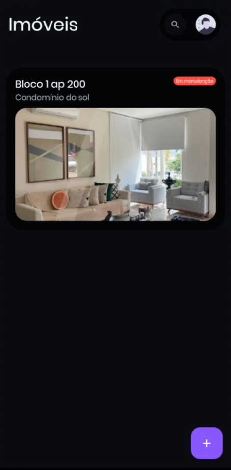
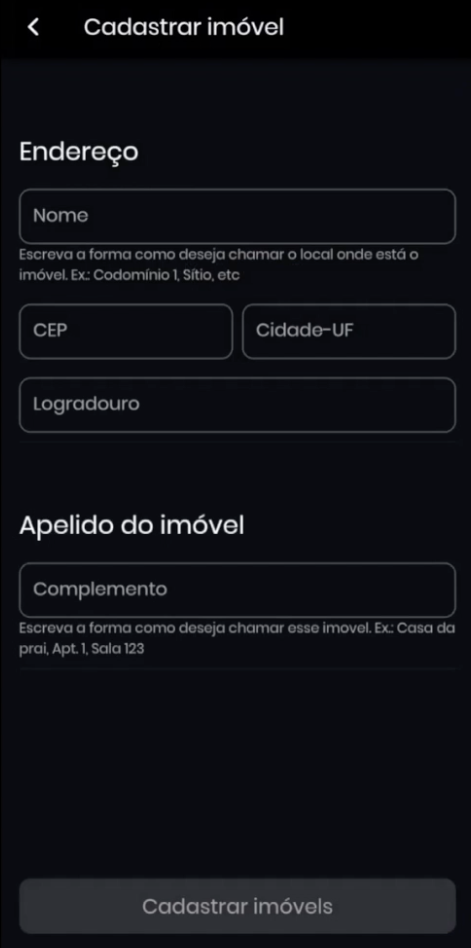
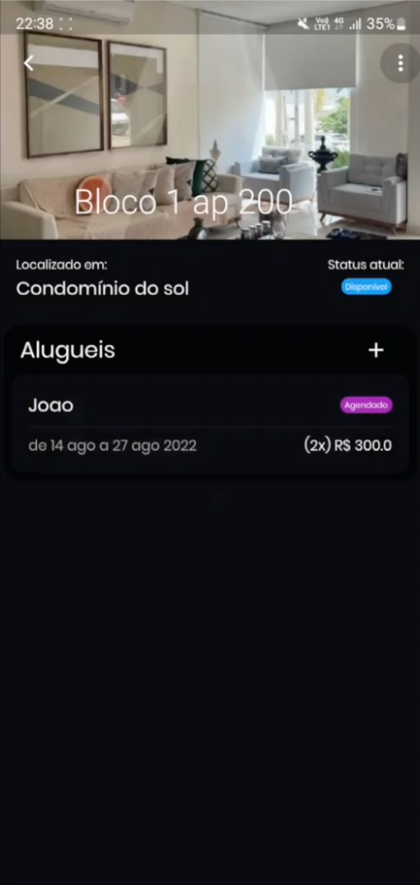
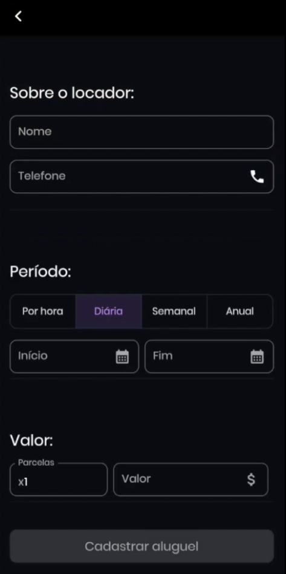

<p align="center">

</p>

# O que é Renter:
O Renter e uma plataforma que visa prover serviços de gerência e
administração de locação de imóveis pessoal, por meio de um aplicativo móvel.

    

# Funcionalidades:
- Crie uma conta offline para proteger as informações dos seus imóveis de curiosos;
- Cadastre imóveis para gerenciá-los;
- Adicione uma foto do imóvel;
- Selecione o estado atual do imóvel (Alugado, indisponível, em manutenção, etc...)
- Cadastre contratações de alugueis, adicionando o inquilino à contratação;
  - É possível alugar por diferentes períodos: Horas, dias, anos;
  
[Demonstração do uso (Youtube)](https://youtu.be/HTAkJhYCOQ4)

# Tecnologias utilizadas:

- Dart - Linguagem de progração
- Flutter - Framework para escrever aplicações mobile. 
- SQLite - Banco de dados relacional local
- Android Studio - Ambiente de desenvolvimento para building da versão Android
- Xcode - Ambiente de desenvolvimento para building da versão iOS

## Instalação / emulação

- Certifique-se que você possui Dart instalado no seu sistema.

- Instale `fvm`, que é um gerenciador de versões do Flutter:
```
dart pub global activate fvm
```
ou (macOS)
```
brew tap leoafarias/fvm
brew install fvm
```

- Instale a versão do Flutter utilizada neste projeto:
```
fvm install 2.10.4
```
- Instale as dependências do projeto:
```
fvm flutter pub get
```
- Emule o aplicativo:
```
fvm flutter run
```
- Para buildar o APK:
```
fvm flutter build apk
```

## License

Distributed under the APACHE 2.0 License. See `LICENSE` for more information.
